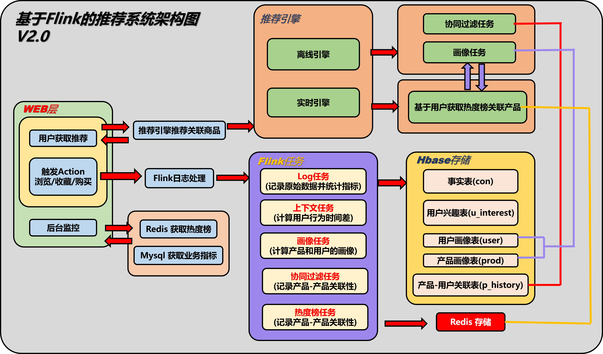
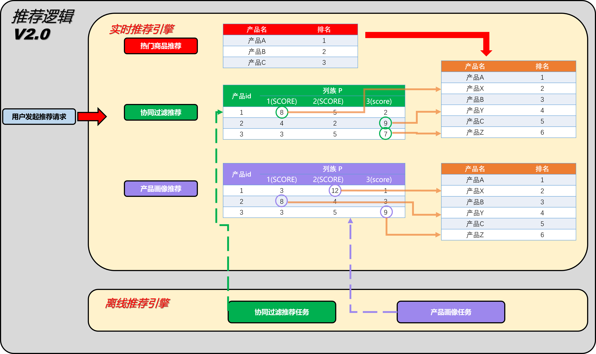
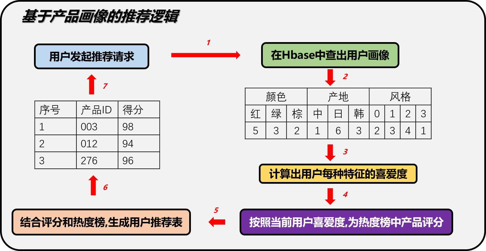

# 商品实时推荐系统

```
项目基于：https://github.com/CheckChe0803/flink-recommandSystem-demo
完善的内容包括：
  1）md文档更新，包括window下部署全步骤说明，引擎说明，推荐算法说明
  2）部分源代码注释
  3）部分代码bug
```

# 1. 系统架构

## **1.1 系统架构图**

<div align=center></div>

## 1.2 数据模块

- a.在数据模块(flink-2-hbase)中,又主要分为6个Flink任务:

  - 用户-产品浏览历史  -> 实现基于协同过滤的推荐逻辑 

    通过Flink去记录用户浏览过这个类目下的哪些产品,为后面的基于Item的协同过滤做准备
    实时的记录用户的评分到Hbase中,为后续离线处理做准备.

    数据存储在的p_history表

    ```java
    //启动flink任务UserHistoryTask，如果本地运行Main方法则控制台不会显示
    flink run ...
    //web模块:RecommandController
    当用户点击商品浏览的链接时，会触发controller的/log请求
    此时会向kafka的主题con发送消息
    //flink-2-hbase:UserHistoryTask.java
    flink会从kafka读取数据源，消费con主题的消息
    将该用户下的产品浏览数加1，hbase:u_history
    该产品下的用户浏览数加1，hbase:p_history
    ```

  - 用户-兴趣 -> 实现基于上下文的推荐逻辑

    根据用户对同一个产品的操作计算兴趣度,计算规则通过操作间隔时间(如购物 - 浏览 < 100s)则判定为一次兴趣事件
    通过Flink的ValueState实现,如果用户的操作Action=3(收藏),则清除这个产品的state,如果超过100s没有出现Action=3的事件,也会清除这个state

    数据存储在Hbase的u_interest表

    ```java
    UserHistoryWithInterestMapFunction
    ```

  - 用户画像计算 -> 实现基于标签的推荐逻辑

    v1.0按照三个维度去计算用户画像,分别是用户的颜色兴趣,用户的产地兴趣,和用户的风格兴趣.根据日志不断的修改用户画像的数据,记录在Hbase中.

    数据存储在Hbase的user表

    ```
    UserPortraitTask
    ```

  - 产品画像记录  -> 实现基于标签的推荐逻辑

    用两个维度记录产品画像,一个是喜爱该产品的年龄段,另一个是性别

    数据存储在Hbase的prod表

    ```
    ProductProtaritTask
    ```

  - 事实热度榜 -> 实现基于热度的推荐逻辑 

    通过Flink时间窗口机制,统计当前时间的实时热度,并将数据缓存在Redis中.

    通过Flink的窗口机制计算实时热度,使用ListState保存一次热度榜

    数据存储在redis中,按照时间戳存储list

    ```
    TopProductTask
    ```

  - 日志导入

    从Kafka接收的数据直接导入进Hbase事实表,保存完整的日志log,日志中包含了用户Id,用户操作的产品id,操作时间,行为(如购买,点击,推荐等).

    数据按时间窗口统计数据大屏需要的数据,返回前段展示

    数据存储在Hbase的con表
    
    ```html
    LogTask
    ```


## 1.3 web模块

- 前台用户界面

  该页面返回给用户推荐的产品list，当前推荐结果分为3列,分别是热度榜推荐,协同过滤推荐和产品画像推荐

  

  

- 后台监控页面

  该页面返回给管理员指标监控，**在后台上显示推荐系统的实时数据**,数据来自其他Flink计算模块的结果.目前包含热度榜和1小时日志接入量两个指标.

  其中，热度榜没有按点击量进行排序，而用户界面的热度榜有进行排序。

  

  


# 2. 推荐引擎

## 2.1 实时引擎

​	从redis获取实时top10榜单数据。

### 2.1.1 基于热度推荐

​	根据用户特征，重新排序热度榜，之后根据两种推荐算法计算得到的产品相关度评分，为每个热度榜中的产品推荐几个关联的产品

<div align=center></div>

​    

## 2.2 离线引擎

基于离线任务调度，每15分钟定时调度一次。数据均来源于p_history表（某产品id下的用户点击数）：

```
//SchedulerJob
ItemCfCoeff item = new ItemCfCoeff();
item.getSingelItemCfCoeff(id, others);
ProductCoeff prod = new ProductCoeff();
prod.getSingelProductCoeff(id, others);
```

1）ProductCoeff，在已经有产品画像的基础上,计算item与item之间的关联系,通过**余弦相似度**来计算两两之间的评分。基于产品标签的相关度（hbase-prod&user，sex-man, sex-woman, age-10,age-20,age-30,age-xx），计算产品的余弦相似度，将其结果放入Hbase-ps，(p:productId，score);

| 相似度 | A    | B    | C    |
| ------ | ---- | ---- | ---- |
| A      | 1    | 0.7  | 0.2  |
| B      | 0.7  | 1    | 0.6  |
| C      | 0.2  | 0.6  | 1    |

 2）ItemCfCoeff，基于协同过滤，计算产品相关度(hbase-p_history,  userId, value)，将其结果放入Hbase-px，(p:productId，score);


### 2.2.1 基于产品画像推荐

​	基于产品画像的推荐逻辑依赖于产品画像和热度榜两个维度,用户画像有三个特征,包含color/country/style三个角度,通过计算用户对该类目产品的评分来过滤热度榜上的产品，最后在已有物品选中的情况下推荐关联性更高的产品.

​	即获取redis中目前top10的热度产品，然后对每一个产品，取离线引擎中计算好的评分（hbase-ps），取相似度最高的前3个产品。

<div align=center></div>

​	

### 2.2.2 基于协同过滤推荐

​	即获取redis中目前top10的热度产品，然后对每一个产品，取离线引擎中计算好的评分（hbase-px），取相似度最高的前3个产品。
​       

# 3. 部署说明

## 3.1 搭建linux虚拟环境

1. 安装vm workstation 16
   VM16 激活许可证
   ZF3R0-FHED2-M80TY-8QYGC-NPKYF

2. 安装centos
   http://mirrors.aliyun.com/centos/7/isos/x86_64/
   linux centos7 下载
   root 	123456
   simon	123456

3. 配置网络
   https://blog.csdn.net/chunmiao3032/article/details/106981026/
   物理机：
   	要配置主机适配器wlan，共享，允许其它网络通过此配置上网
   虚拟机：编辑--虚拟网卡
   	Nat配置：nat模式，
   	网关一定要和无线网卡的网关一样  192.168.1.1

   vi /ect/sysconfig/network-scripts/ifcfg-ens33
   	ONBOOT=yes		
   	BOOTPROTO=static
   	IPADDR=110.100.1.60
   	NETMASK=255.255.0.0
   	GATEWAY=110.100.1.1
   	DNS1=110.100.1.1

   vi /etc/sysconfig/network
   	# Created by anaconda  
   	NETWORKING=yes
   	NETWORKING_IPV6=no
   	HOSTNAME=localost.localdomain --和/etc/hosts中设置的主机名对应
   	GATEWAY=192.168.1.1

   systemctl restart network	
   ip addr --只能显示一块网卡	

   桥接不断的trying other mirror，没法使用
   nat获取连接慢，但下载特别快，后面又好了

4. 换yum源
   yum install -y wget
   --通过改名的方式备份源文件
   mv /etc/yum.repos.d/CentOS-Base.repo  /etc/yum.repos.d/CentOS-Base.repo.backup
   --下载新的源（国内的开源镜像站点主要有：阿里云、网易、清华大学）
   阿里的：wget -O /etc/yum.repos.d/CentOS-Base.repo http://mirrors.aliyun.com/repo/Centos-7.repo
   网易的：wget -O /etc/yum.repos.d/CentOS-Base.repo http://mirrors.163.com/.help/CentOS7-Base-163.repo
   --清楚系统yum缓存，并且将服务器上的软件包信息重新生成缓存到本地，以提高搜索和安装软件的速度
   yum clean all
   yum makecache
   --更新yum
   yum update -y

5. 安装vmware tools
   yum -y install gcc gcc-c++ perl make kernel-headers kernel-devel

   download vmware-tools-windows.iso
   mkdir /mnt/cdrom
   mount /dev/cdrom /mnt/cdrom
   cd /tmp
   tar zxpf /mnt/cdrom/vm...tar.gz
   cd /tmp/vm...
   ./vmtool.pl

6. 主虚共享
   配置vmware主机隔离，重新安装vmware tools就有了
   cd /mnt/hgfs/share

## 3.2 安装DOCKER

1. 安装docker
   不能用vmware的nat模式，要用桥接
   不要忘记了在主机上禁用其它的网络连接，因为可能使用了与桥接相同的ip地址

   yum -y install yum-utils
   yum-config-manager --add-repo http://mirrors.aliyun.com/docker-ce/linux/centos/docker-ce.repo
   yum list docker-ce --showduplicates | sort -r
   yum install docker-ce
   systemctl start docker
   systemctl enable docker  --开机启动

   -- 安装docker-compose		
   yum install -y epel-release	-- 1 安装epel源		
   yum install -y docker-compose -- 2 安装docker-compose

   --配置docker
   ping hub.docker.com  -- 确保能ping通
   vi /etc/docker/daemon.json
   {
    "registry-mirrors":["https://jersktjo.mirror.aliyuncs.com"]
   }
   systemctl daemon-reload 
   systemctl restart docker
   或
   yum install bind-utils  // 安装dig工具
   dig @114.114.114.114 registry-1.docker.io
   vi /etc/hosts
   34.238.187.50    registry-1.docker.io

   测试镜像：
   docker pull tomcat
   docker run --name tomcat -p 8080:8080 -d tomcat

## 3.3 安装相关工具

1. 安装jdk
   yum search java | grep -i --color jdk
   yum install -y java-1.8.0-openjdk-devel.x86_64
   //location
   /etc/alternatives/java_sdk_1.8.0_openjdk

2. 安装ssh
   yum list installed | grep openssh-server
   yum install openssh-server	
   vi  /etc/ssh/sshd_config
   -- 监听端口、地址前的 # 号去除	
   Port 22
   ListenAddress 0.0.0.0
   -- 开启允许远程登录
   PermitRootLogin yes
   -- 开启使用用户名密码来作为连接验证
   PasswordAuthentication yes

   vi /etc/hosts.allow
   --添加
   sshd: ALL

   systemctl restart sshd
   systemctl enable sshd  --开机启动
   systemctl status sshd

   编辑-虚拟机网卡-nat配置，端口转发，添加22端口
   systemctl restart network

   systemctl stop firewalld
   firewall-cmd --query-port=22/tcp
   firewall-cmd --permanent --add-port=22/tcp
   firewall-cmd --reload
   systemctl restart firewalld

   --测试
   ssh localhost
   ssh-keygen -R XXX.XXX.XXX.XXX 为要登陆主机的IP地址

3. 安装maven
   wget https://mirrors.tuna.tsinghua.edu.cn/apache/maven/maven-3/3.6.3/binaries/apache-maven-3.6.3-bin.tar.gz
   tar -xf apache-maven-3.6.3-bin.tar.gz -C /usr/local/
   mv /usr/local/apache-maven-3.6.3/ maven3.6
   vi /etc/profile
   export PATH=$PATH:/usr/local/maven3.6/bin
   source /etc/profile  --让配置生效
   which mvn

## 3.4 启动linux后台服务

启动后台mysql,hbase,redis,kafka,zookeeper,flink
cd /mnt/hgfs/recommand/resources/docker/docker-compose
docker-compose up  -d  -- 后台运行

## 3.5 初始化项目

登录linux，执行sql等初始化工作

  1) mysql
     docker exec -it mysql /bin/bash
     mysql -uroot -p123456
     source /opt/contact.sql;
  2) kafka
     docker exec -it kafka /bin/bash
     /opt/generator.sh
  3) hbase
     docker exec -it hbase /bin/bash	
     hbase shell /opt/hbase_ini.sql
     scan 'user'
  4) windows下运行的配置

   https://github.com/srccodes/hadoop-common-2.2.0-bin   
   HADOOP_HOME=D:\sdk\hadoop-common-2.2.0-bin
   path=%HADOOP_HOME=%\bin

   C:\Windows\System32\drivers\etc\hosts
   	192.168.1.28    docker-linux

   vi /etc/host
   	192.168.1.28		docker-linux

## 3.6 编译与运行

 1. 编译flink-2-hbase模块

    ```
    vi /etc/host
    192.168.1.28 docker-linux
    
    cd /mnt/hgfs/recommand/flink-2-hbase
    mvn clean install  --package则在web模块时会报找不到这个jar
    ```

 2. 运行web模块

    ```
    cd /mnt/hgfs/recommand/web
    mvn package
    mvn spring-boot:run
    ```

## 3.7 项目展示

1. 后台大屏
   http://localhost:8082/index

2. 用户界面
   http://localhost:8082/recommand?userId=1

3. hbase管理界面

   http://192.168.1.28:16010/master-status

4. flink作业界面

   http://192.168.1.28:8081
